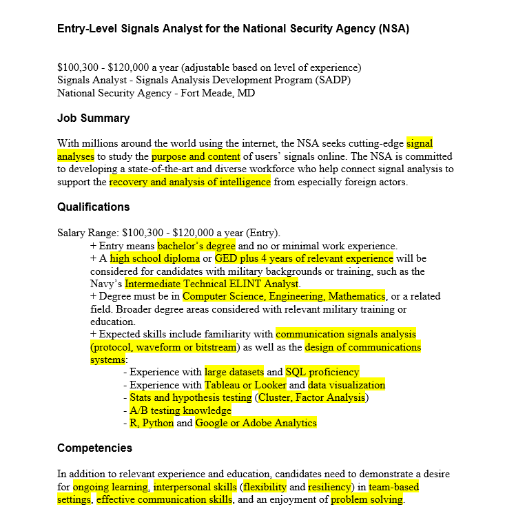

# Job Search Materials

This chapter explores the cration of resumes and cover letters as these remain crucial components of the job application process. 

# Relevance to Readers

Because the resume and cover letter are often the first interaction a potential employer has with you, these documents tend to serve as an introduction. They are meant to set the tone for how employers perceive your qualifications and professionalism. A well crafted resume and cover letter can distinguish you from other applications. By creating a positive first impression you can encourage hiring managers to consider you for an interview. 

## Demonstrating Your Value

Affective job search materials highlight your skills, experience, and achievements in a way that *directly* relates to the job you're applying for. You want to tailor your documents to demonstrate to potential employers that you understand their needs and that you possess the necessary qualifications to meet them. 

## Navigating the Digital Job Market

In today's job market LinkedIn plays a crucial role in connecting job seekers with employers. A well-developed online presence complements your resume and cover letter, offering employers a more comprehensive view of your professional background. You want to present a unified and professiojnal image to potential employers increasing your visibility and appeal in the digital job market. 

## Adapting to Changing Expectations 

The job market continuously evolves, with employers expecting applications to be proficient in both traditional and digital communication methods. 

# Terms to Learn

* **Application Letter**: A formal letter sent with a resume to provide additional details on your qualifications and explain why you are a good fit for the job. This is also known as a *cover letter*
* **Chronological Resume**: A resume format that lists work and educational experiences in reverse chronological order, starting with the most recent. 
* **Dossier**: A collection of documents that may include recommendation letters, transcripts, and other materials requested by employers during the job application process. 
* **Functional Resume**: A resume format the focuses on skills and qualifications rather than chronological work history, often used by individuals with gaps in employement or those changing careers. 
* **Interview**: A formal meeting betweenb a job application and potential employer. 
* **Job Ad Analysis**: The process of examining a job ad to identify keywords and requirements that should be reflected in your job search materials. 
* **Keywords**: Specific words or phrases that appear in job ads and should be incorporated into your resume and application letter to align your qualifications with the job requirements. 
* **Networking**: The practice of building and maintinaing professional relationships that can help you in your job search often through ewvents alumni connections, or social media platforms. 
* **Portfolio**: A collection of work samples that showcase your skills, accomplishments, and experience, often used by professionals in creative or technical fields. 
* **Professionalism**: The conduct, behavior, and attitude that are expected in a business environment, including the presentation of job search materials. 
* **Resume**: A formal document that summarizes your work experience, educations, skills, and accomplishments, used to apply for jobs. 
* **Resume Sections**: The different parts of a  resume including contact info, education, work experience, skills, and options sections like awards or extracurricular activities. 
* **STAR Method**: A technique used to answer interview questions by discussing the Situation, Task, Action, and Result, providing a clear and structured response. 
* **Tailoring**: The process of customizing your resume and application letter to match the specific requirements and preferences of a job postion and employer. 

# General Advice for Job Searches 

* Leveraging Practitioner Expertise: Use advice from people in your field to understand how you should tailor your job search materials. 
* Utilize Available Resources
* Networking: When oppurtunities arise to connect with alumni or workplace recruiters at job fairs, make sure to attend these sessions. These moments are important for building a professional network. Internships are also a valuable way to expand your connections and gain relevant experience. 
* Proofread: Typos in Resumes or other job search materials can drastically hurt your chances of landing a position. 
* Start Your Job Search Early: Think 6 months plus in advance of aquiring a position. 

# Analyzing Job Ads 

Locate keywords in the job-ad and then incorporate these keywords into your materials to demonstrate that you possess the specific qualities being sought. 

The purpose of identifying and highlighting these keywords is to ensure that are prominently featured in job application materials. For example if you have "protocol, waveform, or bitstream" analysis skills as the job-ad asks for, ensure you are highlighting these in your job search materials when applying for this position. 

After pinpointing the keywords, focus on identifying the skills you have that align with the job’s requirements. Highlight any areas where you have direct experience or relevant educational background. Avoid making vague generalizations about your abilities without supporting them with specific examples.

# Writing the Resume 

On average employers spend 20-45 seconds skimming a resume. Therefore, only include relevant information that helps an employer decide whether to interview you. When starying your career you might need to include work experience that seems unrelated such as a summer job as a lifeguard while earning a degree. 

Including work experience depends on your ability to connect this experience to desirable secondary qualifications. For instance, as a lifeguard, did you take on any leadership responsibilities? Did you train new employees or teach CPR sessions, etc. 

Resumes can also be tailored to fit specific positions. An engineering student might read one job ad that mentions, "interpersonal communication skills " and another that emphasized "collaboration required." For the first position you might highlight 3-4 engineering courses and an introductory technical communication course. For the second position, the student might list two communication courses and two engineering courses. 

The appropriate lenghth of a resume can vary. For those with minimal work experience, aim to keep your resume to a single page. If you're unsure what to keep or cut, consider the relevance to the position. You don't need to list every part-time job from high school. Instead, select the role that allowed you to develop a skill the job requires and highlight that skill. For mid-career professionals a multipage resume is expected. 

Effective resumes should be easy to navigate, using design elements like layout and headings. Most resumes include a few stndard sections, contact info, education, work experience. Additional sections could cover skills and certifications, languages, honors and awards, extracurricilar activies, and so on. Some sections may also be specific to certain fields. For instance, many of your professors will have sections for scholarly publications anc conference presentations. 

## Neceesary Resume Sections:

1. Contact Information: Full name, City and State for Address, Phone number, Professional email address, LinkedIn profile URL or other professional social media handles, personal website or protfolio. 
2. Career Summary: A brief statement outlining your career goals and the type of position you are sereking. Alternatively, a summary of qualifications that highlights your most relevant skills and experiences. This sections should use key words and phrases from the job advertisement for the position you are applying for. 
3. Education: Name of institutions, Degrees earned, Majors and Minors, Graduation Dates, Relevant Courswork, Certifications 
4. Work Experience: Job Titles, Name of Employer, Dates of Employment, Key responsibilities and achievements in each role. 
5. Skills: A list of relevant skills tailored to the job you are applying for

## Optional Resume Sections 
1. Certifications and Licenses
2. Honors and Awards 
3. Extracurricular Activies
4. Publications and Presentations 
5. References 

# Writing a Cover Letter

Structure of an Application Letter

1. **Prospective Employer’s Address**: Include the hiring contact person’s name and address at the top of the letter, following the formal business letter format. If the contact person's name is unavailable, use the company’s general address and address the letter to "Dear Hiring Coordinator" or a similar title.
    
2. **Introduction**: In six lines or fewer, state the position you are applying for and where you found the job listing. Briefly introduce your work and educational background, emphasizing its relevance to the position. Mention any personal contacts who currently work at the company or have worked there. Ensure your introduction clearly communicates your specific interest in the company or position; avoid generic statements that could apply to multiple companies.
    
3. **Body Paragraphs**: Use 1–2 body paragraphs to delve into the most relevant qualifications for the position. Focus on concrete details rather than providing a broad overview of all your qualifications. Start each paragraph with a topic sentence, focusing on relevant educational or work experiences.
    
4. **Conclusion**: Reiterate your interest in the position and express your willingness to relocate or undergo additional training if necessary. If you are local, request an in-person interview; if not, suggest an email or phone interview. You may also want to indicate good times for the hiring manager to contact you.